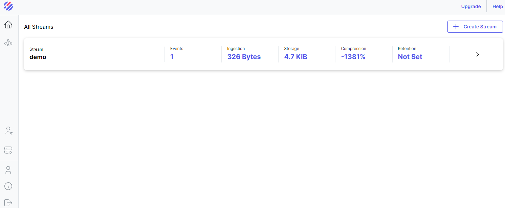

# Parseable CI/CD pipeline

Deploy Parseable server with CI/CD on Elestio

 
 

# Once deployed ...

You can open Parseable web UI here:

    https://[CI_CD_DOMAIN]/
    Login: admin
    password: [ADMIN_PASSWORD]

# Authentication

Parseable API calls require Basic Auth.

For example

    curl --location --request PUT \
    'https://[CI_CD_DOMAIN]/api/v1/logstream/demo' \
    --header 'Authorization: Basic <YOUR_API_KEY>'

## Retrieving Your API Key

1.  Open a new terminal.
2.  Run the following command:

        ./api_key.sh

3.  Enter your credentials when prompted (default credentials are):

        username: admin
        password: [ADMIN_PASSWORD]

4.  Your API key will be displayed.

# Quick start

Parseable uses log streams to organize log data. You can create a log stream with a PUT call to log stream endpoint.

## Create a log stream

    curl --location --request PUT \
    'https://[CI_CD_DOMAIN]/api/v1/logstream/demo' \
    --header 'Authorization: Basic <YOUR_API_KEY>'

## Ingest log data

You can post log data to the log stream demo using POST call to log stream endpoint.

    curl --location --request POST \
    'https://[CI_CD_DOMAIN]/api/v1/logstream/demo' \
    --header 'X-P-META-meta1: value1' \
    --header 'X-P-TAG-tag1: value1' \
    --header 'Authorization: Basic <YOUR_API_KEY>' \
    --header 'Content-Type: application/json' \
    --data-raw '[
        {
            "id": "434a5f5e-2f5f-11ed-a261-0242ac120002",
            "datetime": "2023-01-05T07:20:50.52Z",
            "host": "153.10.110.81",
            "user-identifier": "Mozilla/5.0 (Windows NT 6.1; Win64; x64) Firefox/64.0",
            "method": "PUT",
            "status": 500,
            "referrer": "http://www.google.com/"
        }
    ]'

## Query log data

To query the data via API, use the following command.

    curl --location --request POST 'https://[CI_CD_DOMAIN]/api/v1/query' \
    --header 'Authorization: Basic <YOUR_API_KEY>' \
    --header 'Content-Type: application/json' \
    --data-raw '{
        "query": "select * from demo"
    }'

## Documentation

For more informations here is the documentation:
https://www.parseable.com/docs/docker-quick-start
